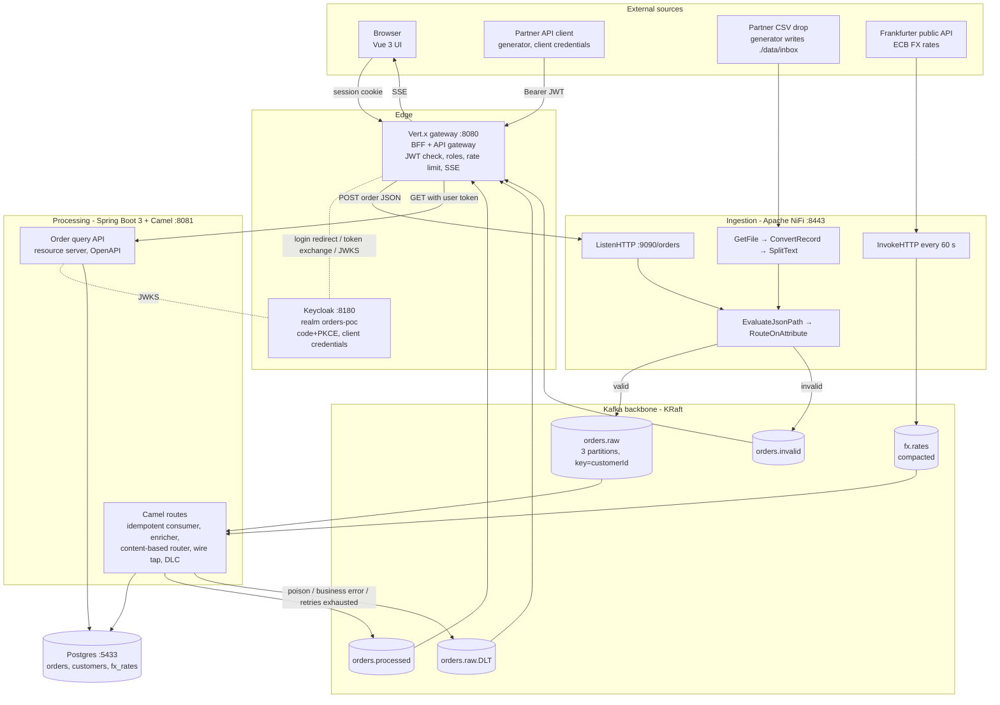
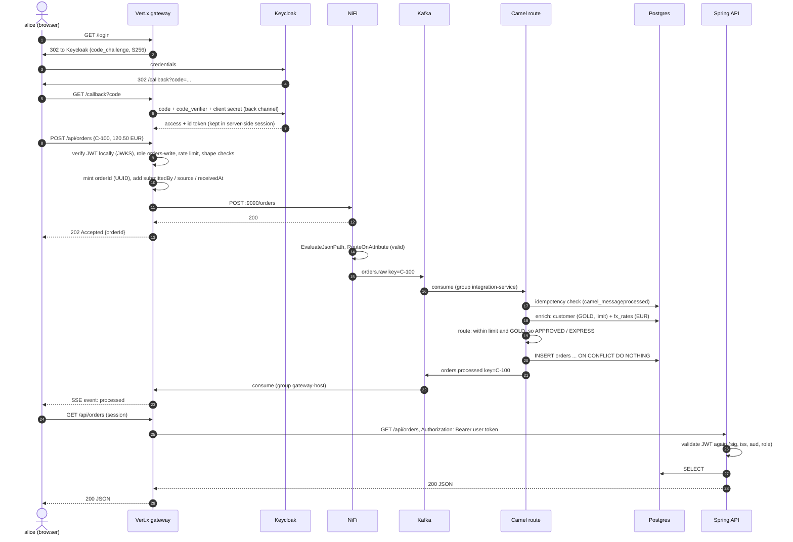
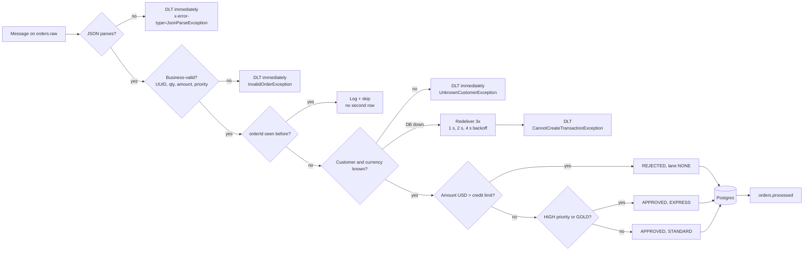
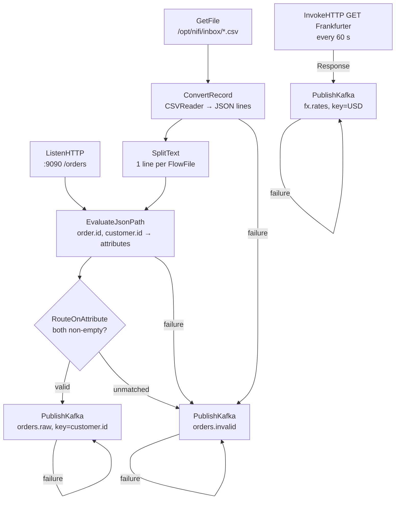
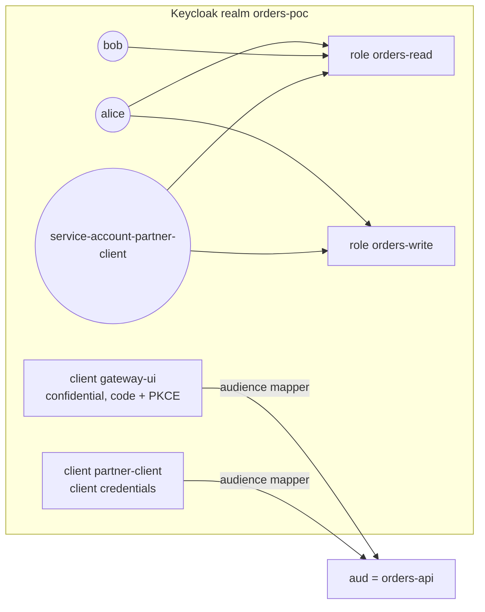
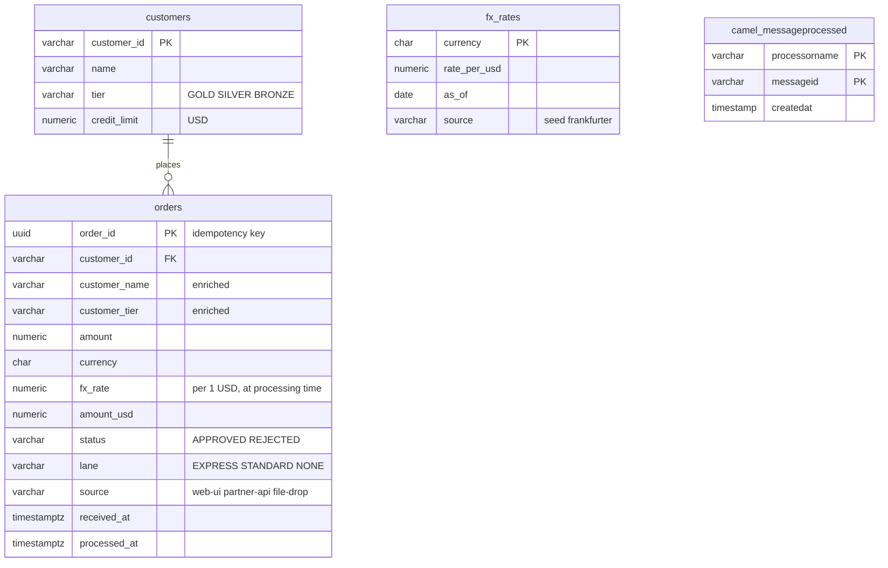
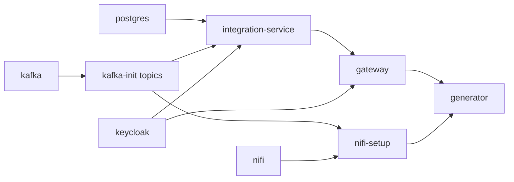

# Architecture

One business flow, **order intake**, runs through every layer. An order can come from three places:

| Channel | Who | Path into the pipeline |
|---|---|---|
| Web UI | A person logged in through Keycloak (alice, bob) | Browser → Vert.x gateway (session) → NiFi ListenHTTP |
| Partner API | A machine client (`partner-client`, OAuth2 client credentials), simulated by the generator | Generator → Vert.x gateway (Bearer JWT) → NiFi ListenHTTP |
| Partner file drop | A partner dropping CSV batches (stands in for SFTP), simulated by the generator | `./data/inbox/*.csv` → NiFi GetFile |

A fourth feed carries **public reference data**. NiFi polls the [Frankfurter API](https://frankfurter.dev) (ECB exchange rates) every minute. Camel then uses those rates to convert EUR, GBP and INR orders to USD before checking credit limits.

## 1. Component view

**Who owns what**

| Component | Responsibility | Does *not* do |
|---|---|---|
| Vert.x gateway | Authentication (session or Bearer), coarse authorisation (roles), edge validation, rate limiting, minting `orderId`, async `202`, proxying reads, pushing events | Business rules, persistence |
| NiFi | Protocol and format adaptation (HTTP, files, CSV→JSON, polling a public API), structural validation, provenance, backpressure | Business logic |
| Kafka | Durable buffer that decouples ingestion from processing, ordering per customer, replay | Transformation |
| Camel (in Spring Boot) | Integration patterns: dedupe, enrich, route, error handling, publish results | Serving HTTP reads |
| Spring Boot API | Read model over Postgres, re-validating the JWT (defence in depth) | Writes |
| Keycloak | Issues tokens, holds users, roles and clients | |

## 2. Happy path (sequence)

## 3. Failure paths

Before Kafka, failures are handled at the edge:

| Where | Failure | Outcome |
|---|---|---|
| Gateway | No or invalid token | `401` problem+json |
| Gateway | Missing role | `403` |
| Gateway | Bad shape (customerId format, quantity, currency) | `400`, nothing is sent downstream |
| Gateway | More than 30 orders per minute per caller | `429` with `Retry-After` |
| Gateway | NiFi down or ListenHTTP applying backpressure | `503`, caller retries |
| NiFi | CSV row without `orderId` or `customerId`, unparseable CSV, non-JSON | Routed to `orders.invalid`, visible in provenance |
| NiFi | Kafka unavailable | PublishKafka `failure` loops back with a 5 s penalty. The queue fills and backpressure stops upstream processors, so nothing is lost. |

## 4. NiFi flow (process group "Order Ingestion")

`infra/nifi/provision_flow.py` builds this flow through the REST API on first start. Open https://localhost:8443/nifi (admin / adminadmin123) to watch queues, open provenance, or stop a processor and see backpressure build.

## 5. Security model

| Check | Gateway (Vert.x) | Integration service (Spring) |
|---|---|---|
| Signature | JWKS fetched from `keycloak:8080` at start-up | JWKS from `keycloak:8080` |
| `iss` | must equal `http://localhost:8180/realms/orders-poc` | same |
| `aud` | must contain `orders-api` | same (custom validator) |
| `exp` | yes (5 s leeway) | yes |
| Roles | `orders-write` for POST, `orders-read` for GET and SSE | `ROLE_orders-read` for GET, everything else denied |

Keycloak runs with `KC_HOSTNAME=http://localhost:8180` and `KC_HOSTNAME_BACKCHANNEL_DYNAMIC=true`. The issuer is therefore the browser-facing URL, while containers can still reach the token and JWKS endpoints at `keycloak:8080`. See ADR-007.

## 6. Data model

## 7. Runtime and ports

| Service | Image or build | Host port | Memory |
|---|---|---|---|
| gateway | `./gateway` (Vert.x 5.2, Java 21) | 8080 | 512 MB limit |
| integration-service | `./integration-service` (Spring Boot 3.5, Camel 4.14 LTS, Java 21) | 8081 | 512 MB limit |
| generator | `./generator` (plain JDK 21) | none | 256 MB limit |
| nifi + nifi-setup | `apache/nifi:2.12.0`, `python:3.13-alpine` | 8443 | 1 GB heap |
| kafka + kafka-init | `apache/kafka:4.3.1` (KRaft, no ZooKeeper) | 9094 | 512 MB heap |
| keycloak | `quay.io/keycloak/keycloak:26.8.0` (dev mode) | 8180 | 512 MB heap |
| postgres | `postgres:17-alpine` | 5433 | none |

Start-up order is enforced by health checks:

